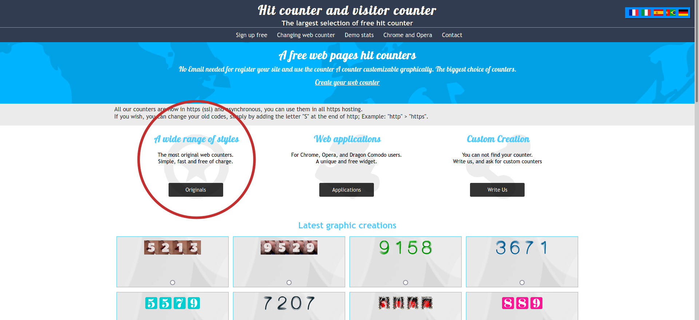
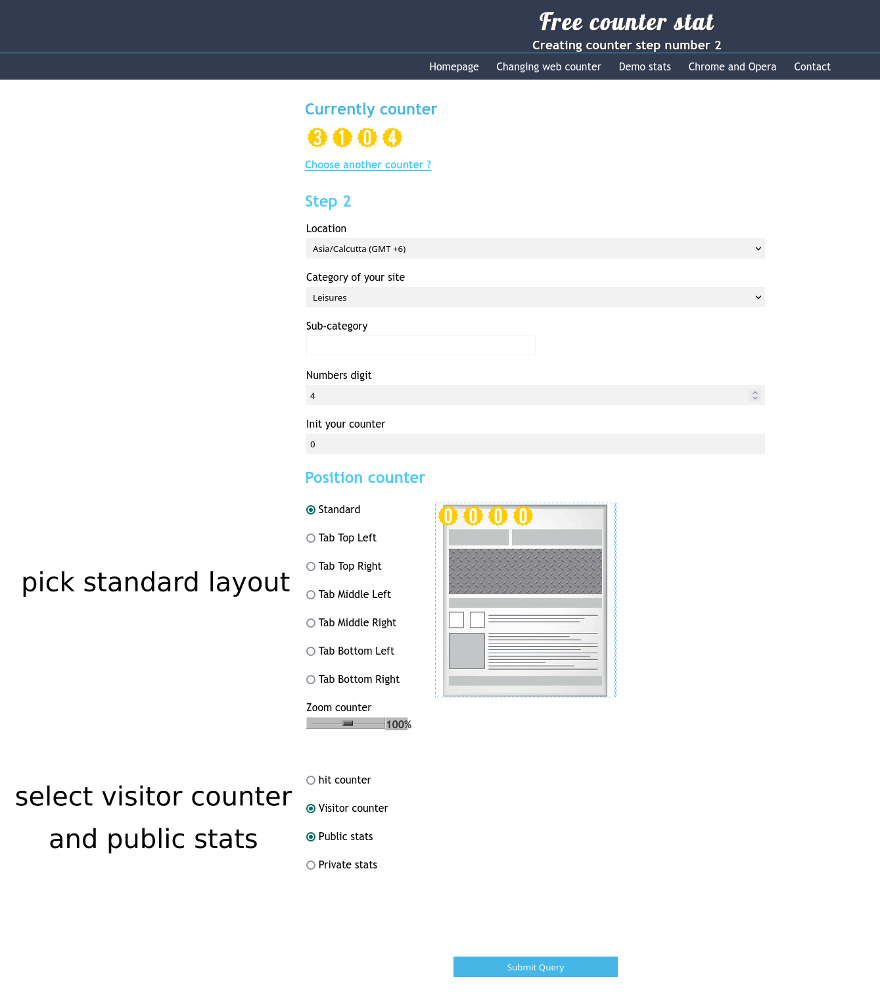
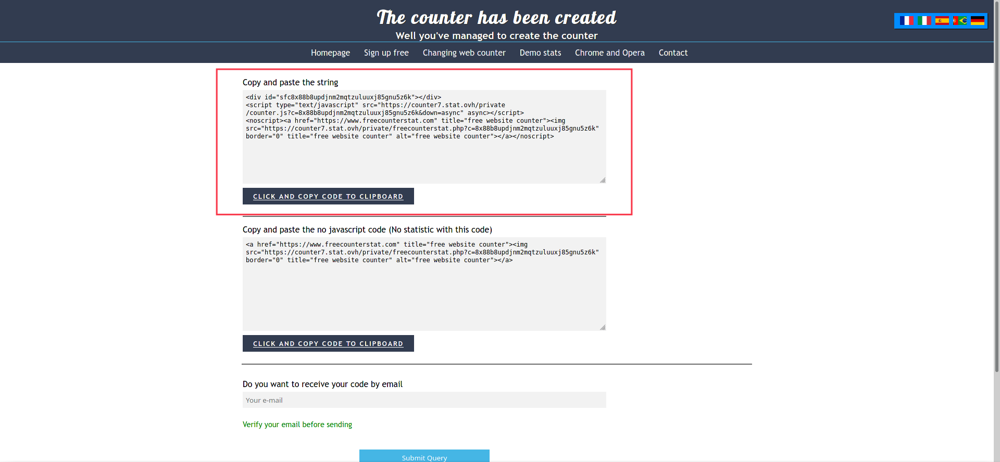
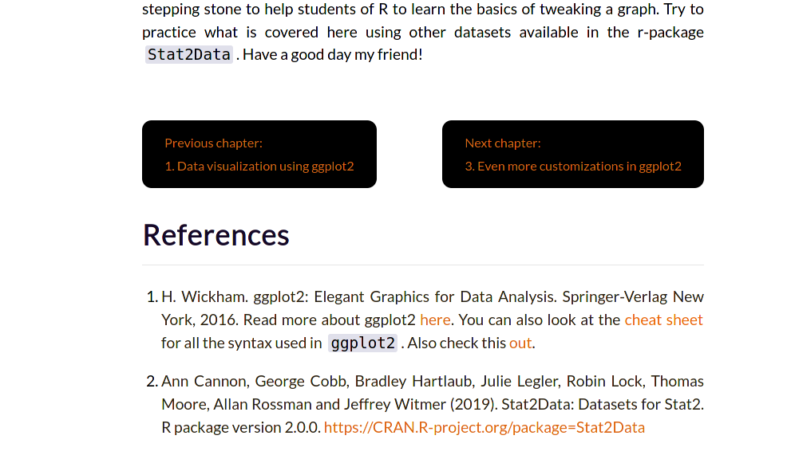
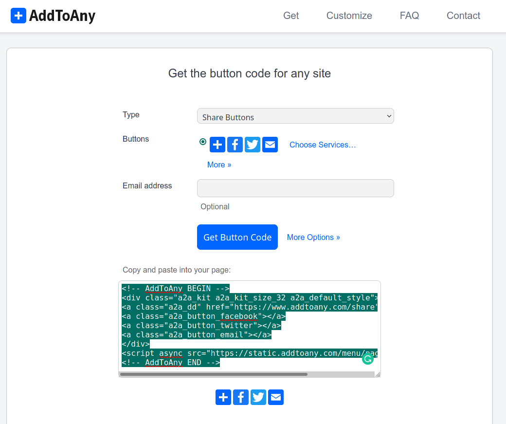

```{r setup, include=FALSE}
knitr::opts_chunk$set(echo = T)
```

## Quality of life mods for distill webistes

In my one month time of learning about the `distill` r-package, I was fascinated by how amazing it is. Without knowing much about HTML or CSS coding, one can build a website from scratch using it. What was every more amazing was that the package had an active and friendly community who have written excellent and easy to follow [tutorials](https://rstudio.github.io/distill/) aiming at beginners like me. Almost everything I know about the `distill` package was thanks to these tutorials. Along the way, I also picked up how to implement a few interesting features that can make a distill website even better. As thanks to all the help, I have received from this community I would like to share some of my findings that might prove useful.

## 1. Making the table of contents more useful

If you had used the `Rmarkdown` package for making websites, before you began using the `distill` package, one thing you will immediately appreciate is the 'table of contents (toc)'. Personally, I feel that the toc in `Rmarkdown` is better than the toc in `distill`. The purpose of a toc is for enabling quick navigation through the contents of an article via headers, so the toc should always be accessible to the reader. In distill articles, however, because of the way they manage the layout of the figures and other elements, a floating toc that is fixed even while scrolling is not possible out of the box. This [issue](https://github.com/rstudio/distill/issues/16) is raised in GitHub and hopefully, the developers will find an elegant way to reintroduce the toc. Nevertheless, all is not lost, from a stack overflow [question](https://stackoverflow.com/questions/67323162/floating-toc-in-distill-for-r/67387516?noredirect=1#comment119140135_67387516) on having a floating fixed toc for distill articles, the answer by [Dr Rich Pauloo](https://stackoverflow.com/users/8367943/rich-pauloo) provides relief. The code provided by Dr Pauloo allows the toc to be fixed on the left side even when you scroll down. But then it will overlap over any element which is extending over the body layout. Also, the default font for the toc in distill is too small I feel, so if you increase the font size while using this code, it will create even more overlapping. So what can be done? 

So one thing I thought of implementing was that I will use the [code](https://stackoverflow.com/questions/67323162/floating-toc-in-distill-for-r/67387516?noredirect=1#comment119140135_67387516) by Dr Pauloo and fix the toc on top-left but with a transparent background. But when I hover over the toc headers it should zoom in on the screen, making the font bigger but over a white background, so that it is more legible. I used white colour as that was my background colour in the article body. I also changed the scrolling behaviour from 'smooth' to 'auto' as it made navigating via toc snappier and more responsive. 

If you are adamant about having a fixed toc like me then you just have to tolerate the overlap problem. Another issue is that by using this code, when your website is viewed on mobile devices, the toc overlaps with the main text. But apart from that, I did not find any other major issues. The modified code is given below;

```{css}
html {
  scroll-behavior: auto;
}
d-article {
    contain: none;
}

/* the value in left: will allow you to change the left edge gap */
/* try using the value I have provided and check if the text goes beyond */
/* the edge of the screen when you hover over using the mouse pointer */
/* otherwise modify the values till you get desirable result */

#TOC {
  position: fixed;
  z-index: 50;
  background: none; /* makes the toc background layer transparent */    
  left: 1.5em; /* changes the left edge gap */
  top: 6em; /* changes the top edge gap */
}

.d-contents nav a:hover {
    color: black;
    transform: scale(1.7); /* change scale to control hover zoom, now it is in 1:7 ratio */
    padding-left:20%; /* change percentage value to control left gap during hover */
    background-color: white; /* background colour on hover, kept as white as it is my bg colour */
    display: block; /* keep it as block to station the text on hover */
}

/* Hide the ToC when resized to mobile or tablet:  480px, 768px, 900px */
@media screen and (max-width: 900px) {
#TOC {
    position: relative;
  }
}
```

Either insert this code in your main theme CSS file, if you are using a custom theme for your distill website. Otherwise, make this as a separate .css file and insert it in the article where you want to implement this feature. For inserting multiple CSS files use the following code below.

```{r, eval=FALSE}
---
title: "Untitled"
date: "`r Sys.Date()`"
output: distill::distill_article
css: [style.css, hover.css] #the hover.css file will be containing the above modified code
---
```

If done properly then you will have a toc just like mine, which is shown on the left side of this page. If you come across any problems while implementing this feature please put it as a comment below this article. I will do my best to solve them.

## 2. Adding a visitor counter

If you fancy a visitor counter on your website and additionally you would also like to know information like the location data of your visitors, how many people are currently online viewing your website etc. then you can add an HTML widget to your page which shows the visitor count. This can be done for free by following the steps below.

1. Visit https://www.freecounterstat.com/ and click on 'originals'. I chose this website as it requires no annoying sign-in or account creation. Plus it is a free service.

```{r, echo=FALSE, fig.cap="Front page of https://www.freecounterstat.com/"}

```

2. Pick the theme you like and customize the widget till you are content. Add relevant details like location, category of your website etc and remember to pick the 'standard' layout if you want the counter to be displayed horizontally. The difference between hit counter and visitor counter is that the hit counter only tracks visits for the page it is installed on whereas the visitor counter tracks all users who have visited any of your pages on your website. So select the 'visitor counter'. You can either make the stats public or private, choose public for as it also allows the readers to see your visitor data. Then finally prove that you are not a robot and press 'submit query'.

```{r, echo=FALSE, fig.cap="Customizing your widget"}

```

3. The first code shown inside the red rectangle in the figure below has a javascript code that allows you to access various interesting information about the visitors to your webpage. Copy the first code.

```{r, echo=FALSE, fig.cap="The code for the visitor counter widget"}

```

4. Insert the copied code which displays the widget in your distill article of liking. For example, the code below will place the counter in the centre of the distill article and will have 'visitors' written above it. Paste the code that you copied between the `<center>` tags before and after the `<div>` tags as shown below. You can take a look at my [file](https://github.com/jeweljohnsonj/jeweljohnson.github.io/blob/main/index.Rmd) for reference.

```html
<center>Visitors<center>
<center>
/* paste the code you copied here */
</div><center>
```
## 3. Adding next/previous button

If you are making a tutorial and have sequential sections or chapters then you might need navigation buttons at the end of each chapter for easy navigation. You can see the picture where I used it for my R tutorial articles. Have a look at my [file](https://github.com/jeweljohnsonj/jeweljohnson.github.io/blob/main/project1.Rmd) for reference.

```{r, echo=FALSE, fig.cap="Source: https://jeweljohnsonj.github.io/jeweljohnson.github.io/project1.html "}

```

Use the following code inside your distill article to get navigation buttons at the end of your page. Change the href values to your respective html files and change the text accordingly for right and left sided buttons

```html
<br> 

<a href="project3.html" class="btn button_round" style="float: right;">Next chapter:
<br> 3. Even more customizations in ggplot2</a>

<a href="project1.html" class="btn button_round" style="float: left;">Previous chapter:
<br> 1. Data visualization using ggplot2</a>
```
You can also modify the button feature using the CSS code below. Add this code template to your main CSS theme file and modify it as you like. 

```{css}
/* next and previous buttons at the end of the article */

.btn {
  border: none; /* button border */
  background-color: #000000; /* button background colour */
  padding: 14px 28px; /* length and width of the button */
  font-size: 16px; /* font size of text inside the button */
  cursor: pointer;
  display: inline-block;
}

.button_round {border-radius: 12px;}

```


## 4. Having social media share buttons

You can display social media share buttons for easy sharing of your articles, like what I have, on the right side of this webpage.

1. Visit https://www.addtoany.com/buttons/for/website and fill up relevant details and get your html code. The reason for choosing this website over others was that you could use their service for free without signing up for an account.
2. Then simply paste that code directly anywhere in your distill article to enable the share buttons. 

Have a look at my [file](https://github.com/jeweljohnsonj/jeweljohnson.github.io/blob/main/project1.Rmd) for reference.

```{r, echo=FALSE, fig.cap="Source: https://www.addtoany.com/buttons/for/website"}

```

## 5. Displaying your twitter feed

If you want to display your tweet activity on your webpage then follow the steps below.

1. First go to your Twitter profile and copy your Twitter profile link address. Then visit https://publish.twitter.com/#. Your profile link would look like this -> `'https://twitter.com/[YOUR TWITTER USERNAME]`
2. Paste the link that you have copied on the input bar and press enter. 
3. Select the 'embedded timeline' for showcasing the live feed of your Twitter activity and then copy the HTML widget code. 
4. Now you can insert the code directly to anywhere on any distill page. As shown below.

<a class="twitter-timeline" data-width="300" data-height="600" data-theme="dark" href="https://twitter.com/jeweljohnsonj?ref_src=twsrc%5Etfw">Tweets by jeweljohnsonj</a><script async src="https://platform.twitter.com/widgets.js" charset="utf-8"></script>

I placed my Twitter feed on the blog page where my posts are listed. By following the [guide](https://rstudio.github.io/distill/blog.html#custom-html) from the distill package tutorial, which allows one to add custom HTML files to the side section of a page, I was able to place the twitter feed on the right side of my [blog page](https://jeweljohnsonj.github.io/jeweljohnson.github.io/blog_posts.html). 

To do the same, first, open a text file in R Studio and using the template code below, paste the HTML code that you copied between the `<div>` tags in the code.

```html
<div class="sidebar-section custom">
  <!--place the code here -->
 
</div>
```
Then save the file as twitter.html (or in any name you like but save as an HTML file) and then include it in the distill blog list page by modifying your collection section in your _site.yml file, like shown below.
 
```{r, eval=FALSE}
collections:
  posts:
    subscribe: _subscribe.html
    custom: twitter.html #the html file containing the twitter feed widget code, add this code
```

Have a look at my [file](https://github.com/jeweljohnsonj/jeweljohnson.github.io/blob/main/_custom.html) for reference. If done properly you are now the proud owner of a Twitter feed widget in your distill website. Good job!


## Summary

So in short in this article we have learned;

1. How to modify the toc to have it fixed on the right side and zoom in, on hover

2. How to add a visitor counter

3. How to add navigation buttons at the end of the page

4. How to add social media share buttons

5. How to display your Twitter feed on your distill website

I hope this was useful and in case you come across some problems, please specify it in the comments. I will try my best to fix them. Thanks!

<!-- adding share buttons on the right side of the page -->

<!-- AddToAny BEGIN -->
<div class="a2a_kit a2a_kit_size_32 a2a_floating_style a2a_vertical_style" style="right:0px; top:150px; data-a2a-url="https://jeweljohnsonj.github.io/jeweljohnson.github.io/" data-a2a-title="One-carat Blog">
<a class="a2a_button_twitter"></a>
<a class="a2a_button_whatsapp"></a>
<a class="a2a_button_telegram"></a>
<a class="a2a_button_google_gmail"></a>
<a class="a2a_button_pinterest"></a>
<a class="a2a_button_reddit"></a>
<a class="a2a_button_facebook"></a>
<a class="a2a_button_facebook_messenger"></a>
</div>
<script>
var a2a_config = a2a_config || {};
a2a_config.onclick = 1;
</script>
<script async src="https://static.addtoany.com/menu/page.js"></script>
<!-- AddToAny END -->
