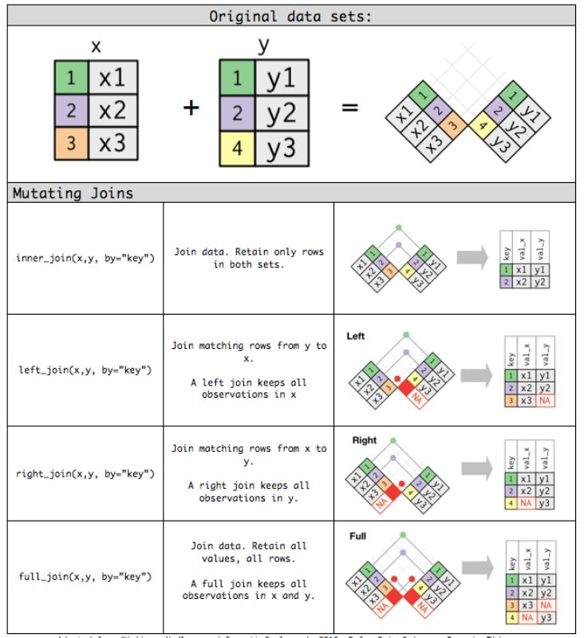
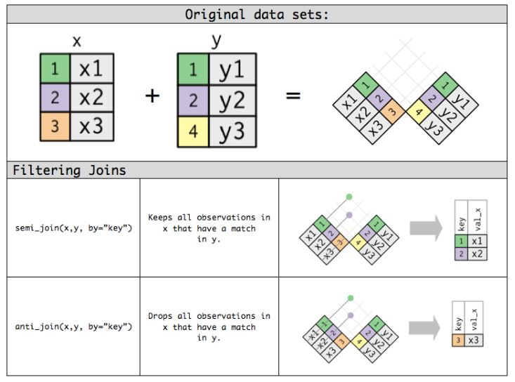

```{r setup, include=FALSE}
library(dplyr)
library(tidyr)
library(palmerpenguins)
library(rmarkdown)
library(knitr)
knitr::opts_chunk$set(echo = TRUE)
```

---
# xaringanExtra package will help us to have inbuilt tabs insdie the article
---

```{r panelset, echo=FALSE}
xaringanExtra::use_panelset()
```

---
# loading javascipt file which helps in folding outputs similar to code folding
---
<script src="js/output_folding.js"></script>


---
#start editing from here
---

## Continuation from the previous chapter

In the [previous chapter](https://jeweljohnsonj.github.io/jeweljohnson.github.io/project5.html) we have seen quite a lot of functions from the `dplyr` package. In this chapter, we will see the rest of the functions where we learn how to handle row names, how to join columns and rows and different set operations in the `dplyr` package.

```{r, eval=FALSE}
#loading neessary packages
library(dplyr)
```

### rownames_to_column() & column_to_rownames()

Tidy data does not use row names. So use `rownames_to_column()` command to convert row names to a new column to the data. The function `column_to_rownames()` does the exact opposite of `rownames_to_column()` as it converts a column into rownames but make sure that the column you are converting into rownames does not contain `NA` values.


```{r, eval=FALSE}
# mtcars dataset contains rownames
# creates new column called car_names which contains row names
mtcars %>% rownames_to_column(var = "car_names")

# returns the original mtcars dataset
mtcars %>% rownames_to_column(var = "car_names") %>%
  column_to_rownames(var = "car_names")
```

## Combine tables/columns

### bind_cols()

Joins columns with other columns. Similar function as that of `cbind()` from base R.

```{r, eval=FALSE}
df1 <- tidytable::data.table(x = letters[1:5], y = c(1:5))
df2 <- tidytable::data.table(x = letters[3:7], y = c(6:10))
bind_cols(df1,df2)

#similar functionality
cbind(df1,df2)
```

### bind_rows()

Joins rows with other rows. Similar function as that of `rbind()` from base R.

```{r, eval=FALSE}
df1 <- tidytable::data.table(x = letters[1:5], y = c(1:5))
df2 <- tidytable::data.table(x = letters[3:7], y = c(6:10))
bind_rows(df1,df2)

#similar functionality
rbind(df1,df2)
```

The functions that are described below have the same functionality as that of `bind_cols()` but give you control over how the columns are joined.

## Mutating joins and filtering joins

Mutating joins include `left_join()`, `right_join()`, `inner_join()` and `full_join()` and filtering joins include `semi_join()` and `anti_join()`.

::: {.l-page}
::: {.panelset}
::: {.panel}
### left_join() {.panel-name}

In the code below, matching variables of df2 are joined with df1. In the final data, you can see that only kevin and sam from df2 are matched with df1, and only those row values are joined with df1. For those variables which didn't get a match, the row values for those are filled with `NA`. You can interpret the variables with `NA` values as; both john and chris are not present in df2.

If you are familiar with set theory in mathematics, what we are doing essentially is similar to $(df1 \cap df2) \cup df1$.

```{r, eval=FALSE}
df1 <- tidytable::data.table(x = c("john","kevin","chris","sam","sam"), y = 1:5)
df2 <- tidytable::data.table(x = c("kevin","sam", "bob"), z = 10:12)

df1 %>% left_join(df2)
```

```{r, echo=FALSE}
df1 <- tidytable::data.table(x = c("john","kevin","chris","sam","sam"), y = 1:5)
df2 <- tidytable::data.table(x = c("kevin","sam", "bob"), z = 10:12)
paged_table(df1 %>% left_join(df2))
```

:::
::: {.panel}
### right_join() {.panel-name}

Similar to `left_join()` but here, you will be joining matching values from df1 to df2, the opposite of what we did earlier. As you can see only kevin and sam from the df1 is matched with df2, and only those row values are joined with df2. For the variables which didn't get a match, the row values for those are filled with `NA`. You can interpret the variables with `NA` values as; bob is not present in df1. 

This function, in the manner used here, is similar to $(df1 \cap df2) \cup df2$.

```{r, eval=FALSE}
df1 <- tidytable::data.table(x = c("john","kevin","chris","sam","sam"), y = 1:5)
df2 <- tidytable::data.table(x = c("kevin","sam", "bob"), z = 10:12)

df1 %>% right_join(df2)
```

```{r, echo=FALSE}
df1 <- tidytable::data.table(x = c("john","kevin","chris","sam","sam"), y = 1:5)
df2 <- tidytable::data.table(x = c("kevin","sam", "bob"), z = 10:12)
paged_table(df1 %>% right_join(df2))
```

:::
::: {.panel}
### inner_join() {.panel-name}

The function `inner_join()` compares both df1 and df2 variables and only joins rows with the same variables. Here only kevin and sam are common in both the dataframes so the row values of only those columns are joined and others are omitted. 

This function is similar to $df1 \cap df2$.  

```{r, eval=FALSE}
df1 <- tidytable::data.table(x = c("john","kevin","chris","sam","sam"), y = 1:5)
df2 <- tidytable::data.table(x = c("kevin","sam", "bob"), z = 10:12)

df1 %>% inner_join(df2)
```

```{r, echo=FALSE}
df1 <- tidytable::data.table(x = c("john","kevin","chris","sam","sam"), y = 1:5)
df2 <- tidytable::data.table(x = c("kevin","sam", "bob"), z = 10:12)
paged_table(df1 %>% inner_join(df2))
```

:::
::: {.panel}
### full_join() {.panel-name}

The function `full_join()` compares both df1 and df2 variables and joins all possible matches while retaining both mistakes in df1 and df2 with `NA` values. 

This function is similar to $df1 \cup df2$.

```{r, eval=FALSE}
df1 <- tidytable::data.table(x = c("john","kevin","chris","sam","sam"), y = 1:5)
df2 <- tidytable::data.table(x = c("kevin","sam", "bob"), z = 10:12)

df1 %>% full_join(df2)
```

```{r, echo=FALSE}
df1 <- tidytable::data.table(x = c("john","kevin","chris","sam","sam"), y = 1:5)
df2 <- tidytable::data.table(x = c("kevin","sam", "bob"), z = 10:12)
paged_table(df1 %>% full_join(df2))
```

:::
::: {.panel}
### anti_join() {.panel-name}

This is an example of filtering join. The function `anti_join()` compares df1 variables to and df2 variables and only outputs those variables of df1 which didn't get a match with df2. 

This function, in the manner used here, is similar to $df1 \cap df2^c$.

```{r, eval=FALSE}
df1 <- tidytable::data.table(x = c("john","kevin","chris","sam","sam"), y = 1:5)
df2 <- tidytable::data.table(x = c("kevin","sam", "bob"), z = 10:12)

df1 %>% anti_join(df2)
```

```{r, echo=FALSE}
df1 <- tidytable::data.table(x = c("john","kevin","chris","sam","sam"), y = 1:5)
df2 <- tidytable::data.table(x = c("kevin","sam", "bob"), z = 10:12)
paged_table(df1 %>% anti_join(df2))
```

:::
::: {.panel}
### semi_join() {.panel-name}

This is an example of filtering join. The function `semi_join()` is similar to `inner_join()` but it only gives variables of df1 which has a match with df2.

```{r, eval=FALSE}
df1 <- tidytable::data.table(x = c("john","kevin","chris","sam","sam"), y = 1:5)
df2 <- tidytable::data.table(x = c("kevin","sam", "bob"), z = 10:12)

df1 %>% semi_join(df2)
```

```{r, echo=FALSE}
df1 <- tidytable::data.table(x = c("john","kevin","chris","sam","sam"), y = 1:5)
df2 <- tidytable::data.table(x = c("kevin","sam", "bob"), z = 10:12)

paged_table(df1 %>% semi_join(df2))
```

:::
:::
:::

Here is a nice graphical representation of the functions we just described now. Image [source](https://rpubs.com/frasermyers/627597).

```{r echo=FALSE, fig.cap = "Source: RPubs.com"}

```

```{r echo=FALSE, fig.cap = "Source: RPubs.com"}

```

## Aditional commands for joins

Additionally, you can specify which common columns to match.

```{r, eval=FALSE}
df1 <- tidytable::data.table(x = c("john","kevin","chris","sam","sam"), y = 1:5)
df2 <- tidytable::data.table(x = c("kevin","sam", "bob"), z = 10:12)

# match with column 'x'
df1 %>% left_join(df2, by = "x")

df3 <- tidytable::data.table(a = c("john","kevin","chris","sam","sam"), y = 1:5)
df4 <- tidytable::data.table(b = c("kevin","sam", "bob"), z = 10:12)

# matching with column having different names, a and b in this case
df3 %>% left_join(df4, by = c("a" = "b"))
```

## Set operations

Similar to the mutating join functions that we had seen, there are different functions related to set theory operations.

### intersect()

Outputs common rows in the dataset.

```{r}
df1 <- tidytable::data.table(x = c("john","kevin","chris","sam","sam"))
df2 <- tidytable::data.table(x = c("kevin","sam", "bob"))

intersect(df1, df2)
```

### setdiff()

Outputs rows in first data frame but not in second data frame.

```{r}
df1 <- tidytable::data.table(x = c("john","kevin","chris","sam","sam"))
df2 <- tidytable::data.table(x = c("kevin","sam", "bob"))

setdiff(df1, df2)
```

### union()

Outputs all the rows in both dataframes

```{r}
df1 <- tidytable::data.table(x = c("john","kevin","chris","sam","sam"))
df2 <- tidytable::data.table(x = c("kevin","sam", "bob"))

union(df1, df2)
```

### setequal()

Checks whether two datasets have same number of rows.

```{r}
df1 <- tidytable::data.table(x = c("john","kevin","chris","sam","sam"))
df2 <- tidytable::data.table(x = c("kevin","sam", "bob"))

setequal(df1, df2)
```

## Summary

In this chapter, we have seen how to handle row names, how to combine columns and rows, what are mutating and filtering joins and various set operations. Thus to conclude this chapter, we have now learned almost all functions in the dplyr package and have seen how to manipulate data efficiently. With the knowledge of the pipe operator that we have seen in chapter 1, we are now equipped to write codes compactly and more clearly. I hope this chapter was useful for you and I will see you next time. Have a good day!  

<br>  

<a href="project5.html" class="btn button_round" style="float: left;">Previous chapter:<br> 2: Data manipulation using dplyr (part 1)</a>

## References

1. Hadley Wickham, Romain François, Lionel Henry and Kirill Müller (2021). dplyr: A Grammar of Data Manipulation. R
  package version 1.0.7. https://CRAN.R-project.org/package=dplyr
  Here is the [link](https://github.com/rstudio/cheatsheets/blob/main/data-transformation.pdf) to the cheat sheet explaining each function in `dplyr`.
