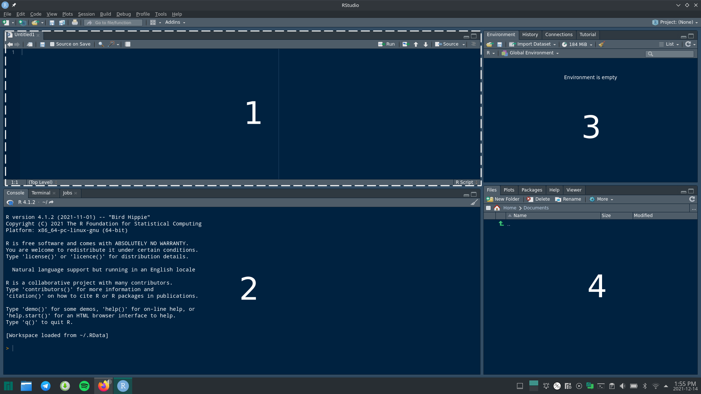

```{r setup, include=FALSE}
library(dplyr)
library(tidyr)
library(palmerpenguins)
library(rmarkdown)
library(knitr)
knitr::opts_chunk$set(echo = TRUE)
```

---
# xaringanExtra package will help us to have inbuilt tabs insdie the article
---

```{r panelset, echo=FALSE}
xaringanExtra::use_panelset()
```

---
# loading javascipt file which helps in folding outputs similar to code folding
---
<script src="js/output_folding.js"></script>


---
#start editing from here
---

## Introduction to R

R programming language was first designed and developed by Dr. Ross Ihaka and Dr. Robert Gentleman back in 1993. It is primarily used in the field of statistics and data visualization. There are third-party software interfaces like the R Studio and Jupyter notebook, which can be used for an interactive experience while using R. The base R capabilities are extended using 'packages' which when installed and loaded can enable new functionality. With over 10,000 packages available to download, R is a versatile programming language fit for a wide variety of tasks. So let us dive into it.

## Installing R and R Studio

R has a terminal interface which is not convenient for everyone. So we would install R Studio along with R which features an interactive desktop environment.

### Windows

To install R in windows 10/11;

1. Visit https://cran.r-project.org/ and click on 'Download R for Windows'
2. Then click on 'base' which will bring you to the the download page
3. In the download page click 'Download R 4.1.2 for Windows'. Download the file in your computer.
4. Install the file in you computer.

To install R Studio

1. Visit https://www.rstudio.com/products/rstudio/download/ and scroll down to 'All Installers'
2. Download the file for windows and install it.

### MacOS

To install R in macOS;

1. Visit https://cran.r-project.org/ and click on 'Download R for macOS'
2. Then click on the latest .pkg file for your version of macOS
3. Download the file in your computer and install it.

To install R Studio

1. Visit https://www.rstudio.com/products/rstudio/download/ and scroll down to 'All Installers'
2. Download the file for macOS and install it.

## Linux

Many linux distributions come with R pre installed. If not then depending on the distribution of linux, use the following command lines to install R and R Studio

### Debian, Ubuntu

For installing R

```{}
apt-get update
apt-get install r-base r-base-dev
```

### Fedora

For installing R

```{}
sudo dnf install R
```

For installing R studio for Debian, Ubuntu and Fedora visit here for the instruction https://www.rstudio.com/products/rstudio/download/. Also for Ubuntu users check [here](https://www.geeksforgeeks.org/how-to-install-r-studio-on-windows-and-linux/).

### Manjaro

Users can also install R from Add/Remove software or use the command line below

```{}
sudo pacman -S r
```

For R Studio

```{}
pamac build rstudio-desktop-bin
```

For installing R and R Studio in other linux distributions please check with your respective linux forums. 

## Basics of R

Here is how R Studio would look like. The theme might be different but apart from that there are no other differences.

```{r echo=FALSE, fig.cap="R studio interface"}

```

You can see different windows numbered from 1 to 4. Each window is plays a specific role which is as follows;

### 1 : Source window 

This is where you can open your R scripts, where you can write down your R codes.

### 2 : Console, Terminal, Jobs windows

There are three windows in this region. The console window shows the outputs of your code. You can also input codes directly in the console, but writing codes on console is cumbersome as its difficult to edit codes or go back to a previous codes that you have run.

The terminal window provides the system shell of your operating system and jobs window is used for running R scripts. 

Normally if you run a R script containing your code, you cannot do much unless the output is given. So if you want to run codes, but at same time does wants to do things side by side, then job windows is where locally run a script. For now you don't have to worry about terminal and job windows.

### 3 : Environment, History, Connections, Tutorial windows

You might not have the build and git windows in your R Studio so don't worry about them. 

In the environment window, all the 'objects' that you have saved or loaded in R will be displayed here. We will soon see what I meant by 'objects' in R. 

History window shows the history of the codes that you run. 

Connections windows is used to connect and work with remote databases, you don't have to be concerned about this as a beginner. 

The tutorial window would be really helpful for you as it features a brilliant beginners tutorial for new R users. It also features an inbuilt console where you can learn and code at the same. Something which you should definitely check out.

### 4 : Files, Plots, Packages, Help, Viewer windows

The file window is your file manager to browse files in your directory. 

Plot window shows the graphs which you plot using R.

Packages window shows the R-packages which are installed in your computer. You can install new packages using the install option in this windows.

Help window is one of the most useful windows. It features a Wikipedia like interface to explain everything about a function in R. We will see how to use this windows soon.

Viewer windows is used to view interactive graphs and animations.

# Creating a project in R

1. In R Studio go File --> New project --> New directory --> New project
2. Fill in the name of you directory as "R_tutorial" or as anything you wish
3. Browse where you want your project directory to be. This will act as your main directory location where your scripts and plots will be saved by default.

This is not typically how someone begins to learn R but I think this an important step. Whenever you start a project or a new work in R always create a new project directory for it . Speaking from experience my directory was filled with files from different projects that I worked on and it was a mess! So better make making project directories a habit from now only. So we have everything ready so let jump into the rabbit hole of R.

# First lines of code

Go to 'File' section the main menu and click New File --> R script. This will create a new R script where we can write out first lines of code. Owing to tradition type the following codes in the R script. To run codes in the R script, press 'Shift+Enter' in the line of the code that you want to run. If you press just 'Enter' it will take you to the next line of the script.

```{r}
# typing the first line of code
print("Hello World")
```

Yeah! you have typed your first lines of code in R. You can also notice here that the first line was not shown in the output. This is because it is inserted as a comment. If you want to annotate your code by writing comments then use `#` before the comment that you want to write.

R recognises mathematical operations and it also follows the BODMAS rule. See the codes below

```{r}
2 + 3
2 - 3
2 * 3
2 / 3
2^3
1+1-1*(1/1)
```

R also recognises logical operators.

```{r}
# is 2 equal to 3
2 == 3
# is 2 greater than 3
2 > 3
# is 2 less than 3
2 < 3
# is 2 greater than or equal to 3
2 >= 3
#is 2 less than or equal to 3
2 <= 3
# is 2 not equal to 3
2 != 3
```

You can see that the outputs are given as `TRUE` or `FALSE` statements. Now consider the lines of code below.

```{r}
134 + 245 
```

Suppose we want to save this output. We can do that by assigning this output value to an object. This can be done using the codes below

```{r}
x <- 134 + 245
#you print value of x by simply entering x 
x
```

To assign values to a variable in R use `<-` and point it to the variable that you want to save the output to. The variables can be words or alphabets or can even contain special characters.

```{r}
#using underscore in variable name
mean_value <- 234 + 456
mean_value
```

I mentioned that you can use special characters, suppose we use the addition operator sign `+`.

```{r, error=TRUE}
a+b <- 344*2
a+b
```

You will get an error saying 'object 'a' not found'. This is because `+` is an operator recognised by R, so here what you are essentially doing is adding object a and b which you have not defined before, even if a and b are defined before hand, the process will still fail as R does not consider 'a+b' as a valid variable name. Now if you must save the result with 'a+b' as the variable name then type the variable between apostrophes. 

```{r}
`a+b` <- 344*2
`a+b`
```

Even if it works try your best to not use characters which have pre-defined fucntion in R in the variable name. A useful character to use would be the underscore `_`. 

With that said, the objects themselves can be used under different mathematical operators.

```{r}
a <- 3
b <- 4
a+b
a-b
#you can also assign objects to new objects as well
c <- a+b
```

Apart from numbers you can also assign letters or words to variable.

```{r}
a <- "apple"
a
```

Now what if you add a variable containing numbers with a variable containing words.

```{r, error=TRUE}
a <- "apple"
b <- 2
a + b
```

Okay that did not work right. The error essentially says on the of the objects that you trying to add have a non-numeric value and thus addition operator cannot be used. So how does R know that 2 is a number and the word "apple" is not a number. R uses 'classes' to categorise the values present in different objects. You check the class of an object using the function `class()`. Let us look at some classes.

```{r}
# real numbers are in 'numeric' class
a <- 1.1
class(a)
# to save a number as integer class use L after the number
a1 <- 2L
class(a1)
# words and letters will have 'character' class
b <- "ball"
class(b)
# TRUE and FALSE belong to the 'logical' class
c<- TRUE
class(TRUE)
# complex numbers are in 'complex' class
d <- 2+3i
class(d)
# NA stands for not applicable, NA is recgonised as logical class in R
e <- NA
class(e)
```

## Vectors

You can also assign more than one value to an object to create vectors.

```{r}
a <- c(1,2,3)
a
b <- c("a", "b", "c")
b
c <- c(1, "a", 3)
c
class(a)
class(b)
class(c)
```

In object 'c', you can see that it has both character and numeric class elements. But when you check class of c, it is shown as 'character'. So if a character element is present in the data along with numbers, then those numbers would be treated as characters by R. By assigning multiple values to a variable, the object that you have made is essentially a vector. Let us look some more commands

```{r}
a <- c(1,2,3,4,5)
# gives the length of the vector a
length(a)
# outputs the structure of the vector a, useful in viewing datasets
str(a)
```

You can also assign names for the vector columns using the function `names()`.

```{r}
a <- c("apple", "carrot")
names(a) <- c("fruit", "vegetable")
a
```

You can also perform mathematical operations on vectors.

```{r}
# creates a sequence of numbers from 1 to 5
a <- c(1:5)
b <- c(6:10)
a
b
a + b
a - b
a * b
a / b
```

As you can see, the respective column values in each of the vector is used for the operations.

## Matrix

Vectors are essentially one dimensional matrices. So let us create a matrix in R using the function `matrix()`

```{r}
# this will create a matrix having values from 1 to 12
# byrow = TRUE tells R that values should be filled in row wise order
# nrow = 4 means no of rows should be 4
matrix(1:12, byrow = TRUE, nrow = 4)
```

Now let us try to create a matrix using different objects

```{r}
a <- c(1:5)
b <- c(6:10)
d <- c(a,b)
matrix(d, byrow = TRUE, nrow = 2)
```

You can also assign row names and column names for this matrix

```{r}
a <- c(1:3)
b <- c(6:8)
d <- c(a,b)
my_matrix <- matrix(d, byrow = TRUE, nrow = 2)
# changing row names
rownames(my_matrix) <- c("a", "b")
# changing column names
colnames(my_matrix) <- c("first", "second", "third")
my_matrix
```

## Summary


 

## References


